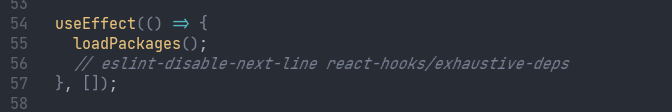
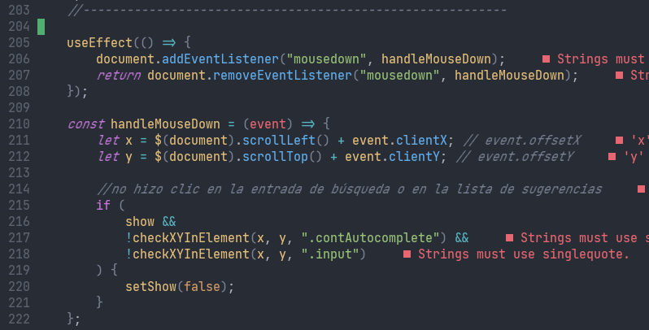
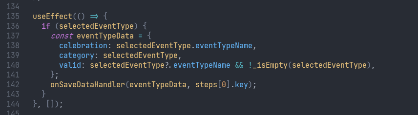
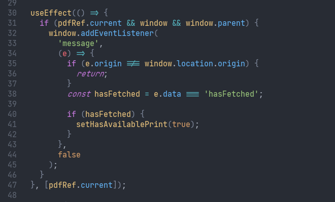
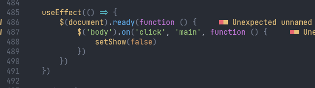

<pre class="text-5xl font-semibold">La perplejidad de useEffect</pre>

<div class="abs-br m-6 flex items-center gap-2">
  <carbon-logo-facebook class="w-8 h-8" />
  <carbon-logo-twitter class="w-8 h-8" />
  <carbon-logo-github class="w-8 h-8" />
  <pre class="font-semibold text-xl">/vmkevv</pre>
</div>

---

# Before effects, let's review rendering

```jsx
import extraMenuItems from '@constants/extraMenuItems';

const SelectMenu = ({ items, onSelectItem }) => {
  const [isOpen, setOpen] = useState(false);

  const menuItems = items
    .filter((item) => item.enabled)
    .map((item) => ({value: item.id, label: item.name}));

  menuItems.concat(extraMenuItems);

  return (
    <div>
      {/* implementation */}
    </div>
  );
};

```

---

# What is useEffect?

---

# What is useEffect?

> #### The _Effect Hook_ lets you perform side effects in function components

---

# What is useEffect?

> #### The _Effect Hook_ lets you perform side effects in function components

---

# What is useEffect?

> #### The _Effect Hook_ lets you perform side effects in function components

<div class="h-4" />

> #### You can tell React to skip applying an effect if certain values haven’t changed between re-renders. To do so, pass an array as an optional second argument to _useEffect_

---

# What is useEffect?

> #### The _Effect Hook_ lets you perform side effects in function components

<div class="h-4" />

> #### You can tell React to skip applying an effect if certain values haven’t changed between re-renders. To do so, pass an array as an optional second argument to _useEffect_

<div class="h-8" />

```jsx {all|4-6|11|all}
function Example() {
  const [count, setCount] = useState(0);

  useEffect(() => {
    document.title = `You clicked ${count} times`;
  }, [count]);

  return (
    <div>
      <p>You clicked {count} times</p>
      <button onClick={() => setCount(count + 1)}>
        Click me
      </button>
    </div>
  );
}
```

---

# useEffect types
### No deps array: Runs after component update + initial mount
```jsx
  useEffect(() => {
    // do something
  });
```

---

# useEffect types
### No deps array: Runs after component update + initial mount
```jsx
  useEffect(() => {
    // do something
  });
```

### Empty deps array: Runs after the initial mount

```jsx
  useEffect(() => {
    // do something
  }, []);
```

---

# useEffect types
### No deps array: Runs after component update + initial mount
```jsx
  useEffect(() => {
    // do something
  });
```

### Empty deps array: Runs after the initial mount

```jsx
  useEffect(() => {
    // do something
  }, []);
```

### Deps array: Runs after any array change

```jsx
  useEffect(() => {
    // do something with some vars
  }, [some, vars]);
```

---

# Don't think in Component lifecycle

<div class="h-8" />
#### Don't look for functional equivalents for `componentDidMount, componentDidUpdate, componentWillUpdate, etc.`

<div class="h-8" />

#### __Think in effects__ instead

---

# Dependency array
```jsx {all|3}
  useEffect(() => {
    // do something with some vars
  }, [some, vars]);
```
---

# Dependency array
```jsx {all|3}
  useEffect(() => {
    // do something with some vars
  }, [some, vars]);
```

Equality?

```js 
{a: 1} === {a: 1} // false
{} === {} // false
[] === [] // false
```


---

# Dependency array
React source code, check dependency array equality

```jsx
function areHookInputsEqual(nextDeps, prevDeps) {
  // some checks
  for (let i = 0; i < prevDeps.length && i < nextDeps.length; i++) {
    if (objectIs(nextDeps[i], prevDeps[i])) {
      continue;
    }
    return false;
  }
  return true;
}

```

---

# Dependency array
React source code, check dependency array equality

```jsx
function areHookInputsEqual(nextDeps, prevDeps) {
  // some checks
  for (let i = 0; i < prevDeps.length && i < nextDeps.length; i++) {
    if (objectIs(nextDeps[i], prevDeps[i])) {
      continue;
    }
    return false;
  }
  return true;
}

```

```jsx
const objectIs = typeof Object.is === 'function' ? Object.is : is; // is = Object.is polyfill 
```

---

# Dependency array
React source code, check dependency array equality

```jsx
function areHookInputsEqual(nextDeps, prevDeps) {
  // some checks
  for (let i = 0; i < prevDeps.length && i < nextDeps.length; i++) {
    if (objectIs(nextDeps[i], prevDeps[i])) {
      continue;
    }
    return false;
  }
  return true;
}

```

```jsx
const objectIs = typeof Object.is === 'function' ? Object.is : is; // is = Object.is polyfill 
```

``Object.is(a, b)`` is basically ``a === b`` but with edge cases

---

# eslint-plugin-react-hooks, react-hooks/exhaustive-deps

Eslint plugin to help with the array dependency for useEffect, useMemo and useCallback.


---

# Dependency array

```jsx
const Example = ({someFunction}) => {
  const [user, setUser] = useState(null);

  useEffect(() => {
    // code
    someFunction(user);
  }, [user]); // warning

  return // JSX
};
```

---

# Dependency array

```jsx
const Example = ({someFunction}) => {
  const [user, setUser] = useState(null);

  useEffect(() => {
    // code
    someFunction(user);
  }, [user, someFunction]);

  return // JSX
};
```
<div class="h-6" />

```jsx
const Parent = () => {
  const someFunction = (user) => {
    // re-renders this comp
  }
  return (
    <Example someFunction={someFunction} />
  )
}
```

---

# Dependency array

```jsx
const Example = () => {
  const [data, setData] = useState(null);

  const fetchData = () => {
    getServerData().then((resp) => {
      setData(resp.data);
    });
  };

  useEffect(() => {
    fetchData();
  }, []); // warning
  return // JSX
};
```
---

# Dependency array (fixed)

```jsx
const Example = () => {
  const [data, setData] = useState(null);

  const fetchData = () => {
    getServerData().then((resp) => {
      setData(resp.data);
    });
  };

  useEffect(() => {
    fetchData();
  }, [fetchData]); // 😫 infinite rendering loop
  return // JSX
};
```

---

# Dependency array

```jsx
const Example = ({id}) => { // id may change
  const [data, setData] = useState(null);

  const fetchData = () => {
    getServerData(id).then((resp) => {
      setData(resp.data);
    });
  };

  useEffect(() => {
    fetchData(); // after initial mount
  }, []);
  return // JSX
};
```

---

# Dependency array (fixed)

```jsx
const Example = () => {
  const [data, setData] = useState(null);

  const fetchData = useCallback(() => { // memoize function, fetchData is not a new function in every render
    getServerData().then((resp) => {
      setData(resp.data);
    });
  }, []);

  useEffect(() => {
    fetchData();
  }, [fetchData]);
  return // JSX
};
```

---

# Dependency array (fixed)

```jsx
const Example = () => {
  const [data, setData] = useState(null);

  useEffect(() => {
    const fetchData = () => {
      getServerData().then((resp) => {
        setData(resp.data);
      });
    };
    fetchData();
  }, []);
  return // JSX
};
```

---

# Dependency array (fixed)

```jsx
const Example = ({id}) => {
  const [data, setData] = useState(null);

  const fetchData = useCallback(() => { // memoize function, fetchData is not a new function in every render
    getServerData(id).then((resp) => {
      setData(resp.data);
    });
  }, [id]);

  useEffect(() => {
    fetchData();
  }, [fetchData]);
  return // JSX
};
```

---

# Dependency array (fixed)

```jsx
const Example = ({id}) => {
  const [data, setData] = useState(null);

  useEffect(() => {
    const fetchData = () => {
      getServerData(id).then((resp) => {
        setData(resp.data);
      });
    };
    fetchData();
  }, [id]);
  return // JSX
};
```

---

# Let's review some production code!
## 👀

---

# Let's review some production code!
## 🥲


---

# Let's review some production code!
## 😫


---

# Let's review some production code!
## 😬


---

# Let's review some production code!
## 😅


---

# Let's review some production code!
## 😭


---

# Want to go deeper?

---
layout: iframe
url: https://overreacted.io/a-complete-guide-to-useeffect/
---
---
layout: center
class: text-center
---

# Thank you!

<div class="abs-br m-6 flex items-center gap-2">
  <carbon-logo-facebook class="w-8 h-8" />
  <carbon-logo-twitter class="w-8 h-8" />
  <carbon-logo-github class="w-8 h-8" />
  <pre class="font-semibold text-xl">/vmkevv</pre>
</div>
